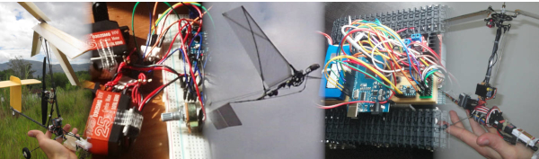

<h1 align="center">👋 Hi, I'm Mags 👋</h1>

<h3 align="center">A mechanical engineer that likes to code</h3>

- 🔭 I’m currently working on flight controllers for rc aircraft, simple web apps, and my blog.

- 👨‍💻 Most of my projects are available on my [github profile](https://github.com/RCmags)

- 📝 I ocassionally write articles on my [blog](https://rcmags.github.io/).

- :heavy_exclamation_mark: Be sure to check out my [RCgroups](https://www.rcgroups.com/forums/member.php?u=189488) account! There's lots of good information there.

- 💬 Ask me about anything that's in my repos or blog. I especially like model aircraft and unusual vehicles! :airplane: :helicopter: 

- 📄 Check out my super-awesome [resume](https://cdn2.careeraddict.com/uploads/article/53133/13._20Simplicity_20is_20key.jpeg).

<!--
- :trollface: Fun fact: I once glued my eyelashes with superglue.
- 🌱 I’m currently learning how to be an adult.
- 🤝 I’m looking for help with life. Any suggestions?
-->

## :chart_with_upwards_trend: Profile Statistics

## :ledger: Lastest blog posts
<!-- BLOG-POST-LIST:START -->
- [Remarks on Slow Laptops and Low-Performance Computers](https://rcmags.github.io/blog/computers/2024/08/13/remarks-old-laptops.html)
- [DIY Laptop powerbank / Battery power supply](https://rcmags.github.io/blog/computers/2024/06/16/laptop-ups.html)
- [Machine learning frameworks | A newbie perspective](https://rcmags.github.io/blog/research/2024/06/08/machine-learning-1.html)
- [Initial foray into machine learning](https://rcmags.github.io/blog/research/2024/06/06/machine-learning.html)
<!-- BLOG-POST-LIST:END -->

## 📫 How to reach me
Contact me through __RCgroups__, __youtube__, or send me an __email__:

  

 

You can also start an [issue here on github](https://github.com/RCmags/RCmags/issues) to use it as a makeshift forum. 

## :wrench: Languages and Tools

 

Engineering:  

  

  
 
  
  

  
   
  
Languages:

  

 

 
 
 

  
 
  
Web-development:  

 
  
  
  
 

   
  
 

 
  

